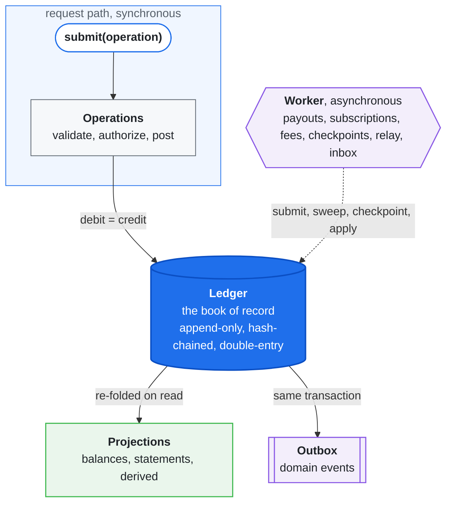

<h2 align="left">
  <picture>
    <source media="(prefers-color-scheme: dark)" srcset="assets/logo-dark.svg">
    
  </picture>
  &#160;economy-lab
</h2>

A provably-solvent credits economy: wallets, payouts, subscriptions, and a marketplace, on one double-entry ledger.


**On this page**

- [Highlights](#highlights)
- [Quick start](#quick-start)
- [Architecture](#architecture)
- [What it demonstrates](#what-it-demonstrates)
- [Run it](#run-it)
- [Documentation](#documentation)

---

> Read the full documentation: [economy-lab-docs.pages.dev](https://economy-lab-docs.pages.dev/economy/).

## Highlights

- **Zero runtime dependencies** — pure TypeScript; the whole economy runs in-memory with no infrastructure.
- **Provably solvent** — `read.prove()` checks every solvency and integrity invariant; `make prove` and `make fuzz` surface any leak or drift.
- **Tamper-evident by construction** — every balance folds from an append-only, hash-chained, double-entry log under signed Merkle checkpoints.
- **One codebase, five backends** — in-memory, Postgres, MySQL, Redis, and SQS run identical logic, pinned by a single conformance suite.
- **Safe by default** — `submit` returns an `Outcome` and never throws for a "no"; every request is idempotent.

## Quick start

Build an `Economy`, drive it through a single `submit`, and read derived state through `read`. The
in-memory build needs no infrastructure — `compose` picks adapters from the environment — and either
way you supply four integrations: a `signer`, a payout `processor`, an FX `rates` source, and a fee
`pricing` policy:

```ts
import { compose } from './src/index.ts';

const economy = await compose(process.env, {
  signer,
  processor,
  rates,
  pricing,
});

const outcome = await economy.submit(operation); // do one thing → an Outcome (never throws for a "no")
const balance = await economy.read.balance(account); // read a derived balance
const report = await economy.read.prove(); // check every solvency & integrity invariant
await economy.close();
```

## Architecture



The same logic runs in-memory and on Postgres or MySQL through swappable **engines** (databases that
enforce the invariants natively) and **adapters** (pluggable cache and event transports). One
conformance suite holds them to identical behavior.

## What it demonstrates

| Capability                   | Where                                                                                                          | What it guarantees                                                                                                                     |
| ---------------------------- | -------------------------------------------------------------------------------------------------------------- | -------------------------------------------------------------------------------------------------------------------------------------- |
| Double-entry ledger          | [ledger.ts](src/ledger.ts)                                                                                     | A posting is rejected unless its debit and credit lines net to zero per currency; a balance is the sum of its lines.                   |
| Tamper-evident history       | [chain.ts](src/chain.ts), [integrity.ts](src/integrity.ts)                                                     | Each posting is hash-chained per account; a signed Merkle checkpoint anchors the whole ledger; `proveChain` locates any altered entry. |
| Idempotent requests + outbox | [economy.ts](src/economy.ts), [worker/relay.ts](src/worker/relay.ts)                                           | A retried request runs once: key, postings, and outbound event all commit in one transaction; duplicates replay.                       |
| Marketplace + fee policy     | [operations/spend.ts](src/operations/spend.ts), [pricing.ts](src/pricing.ts)                                   | A sale charges the buyer and pays the sellers in one balanced transaction; shares sum to 100%; the fee is injected policy.             |
| Payout saga + retries        | [operations/requestPayout.ts](src/operations/requestPayout.ts), [worker/payouts.ts](src/worker/payouts.ts)     | The worker submits a payout; the settlement webhook settles it once (deduped); a stuck payout re-drives then reverses.                 |
| Recurring subscriptions      | [operations/subscribe.ts](src/operations/subscribe.ts), [worker/subscriptions.ts](src/worker/subscriptions.ts) | Each period bills once; an underfunded renewal lapses instead of overdrawing.                                                          |
| Refunds & clawback           | [operations/refund.ts](src/operations/refund.ts), [operations/clawback.ts](src/operations/clawback.ts)         | A reversal restores each account the sale touched, booking any uncollectable remainder to a receivable.                                |
| Settlement maturity gate     | [maturity.ts](src/maturity.ts)                                                                                 | Payouts release only funds settled past the chargeback window; fresh credits are held back until they mature.                          |
| Spend-velocity risk gate     | [trust.ts](src/trust.ts)                                                                                       | Recent spend is summed over a sliding window and checked against a limit before any money moves.                                       |
| Swappable storage            | [engines/](src/engines), [adapters/](src/adapters)                                                             | The same logic runs in-memory and on Postgres, MySQL, Redis, and SQS; one conformance suite runs against every backend.                |

`make prove` and `make fuzz` attack these invariants after every operation and across every backend.

## Run it

```bash
make dev         # local HTTP server — in-memory, dev secrets, hot reload; zero setup
make start       # HTTP service against the configured environment
make worker      # background sweep loop
make test        # the full suite, zero infra, all in-memory
make check       # typecheck + eslint + prettier + test (the CI gate)
make demo        # compose an economy and run a sample money flow
make prove       # randomized invariant proof; exits non-zero on any leak or drift
make fuzz        # cross-backend differential — every backend must produce identical results
```

The bundled host process runs as an HTTP service (`POST /submit`, `POST /webhooks/:provider`, plus
`/healthz` and `/readyz`) and a background worker (ten sweeps on an interval). Every backend is
selected by an environment variable.

## Documentation

- [The Economy surface](https://economy-lab-docs.pages.dev/economy/reference/the-economy/) — the whole `submit` / `read` / `close` API.
- [The proof](https://economy-lab-docs.pages.dev/economy/concepts/the-proof/) — how `make prove` and `make fuzz` attack the invariants.
- [HTTP service](https://economy-lab-docs.pages.dev/economy/reference/http-service/) — `POST /submit`, webhooks, and health checks.
- [Background worker](https://economy-lab-docs.pages.dev/economy/reference/background-worker/) — the ten sweeps and how they run.
- [Configuration](https://economy-lab-docs.pages.dev/economy/reference/configuration/) — every environment variable and backend selector.

## License

MIT — see [LICENSE](LICENSE).
